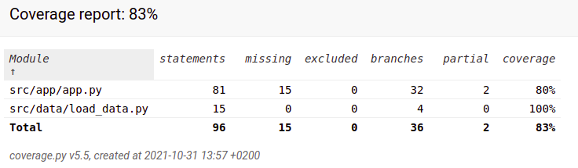

# Testausdokumentti

Projektin testaaminen on hieman hankalaa, sillä prosessoitava kuva vaihtelee ja näin myös tunnistuksen tulokset vaihtelevat. Yksittäiset apumetodit on pyritty testaamaan kattavasti.

Ohjelmaa testataan empiirisesti jatkuvasti. Ohjelma näyttää yksittäisen kuvan algoritmin antaman veikkauksen, sekä prosenttiosuuden tästä numerosta lähimpien naapureiden joukossa.

Ohjelma antaa myös komentoriville prosenttiosuuden oikein menneistä arvauksista.

### Kattavuusraportti:

